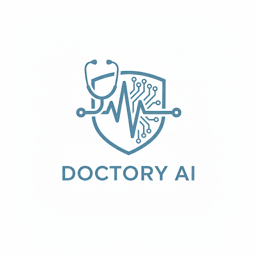

# DOCTORY AI: A Multi-Modal AI System for Preliminary Disease Diagnosis


<p align="center">
  
</p>

DOCTORY AI is an intelligent, integrated platform designed for preliminary medical diagnosis. It combines the analytical power of multiple specialized AI models with the communicative prowess of a Large Language Model (LLM) to create a seamless, user-friendly experience. Users can upload medical images or describe symptoms in a conversational manner and receive clear, empathetic, and actionable health insights.

## ⚠️ Important Disclaimer

This system is an academic proof-of-concept and serves as a preliminary, informational tool only. **It is not a substitute for professional medical diagnosis, advice, or treatment.** Always consult with a qualified healthcare provider for any medical concerns. This disclaimer is prominently displayed throughout the application.

## 📋 Table of Contents

- [About The Project](#-about-the-project)
- [Key Features](#-key-features)
- [System Architecture](#-system-architecture)
- [Tech Stack](#-tech-stack)
- [Datasets](#-datasets)
- [Getting Started](#-getting-started)
  - [Prerequisites](#prerequisites)
  - [Installation](#installation)
- [Usage](#-usage)
- [Model Performance](#-model-performance)
- [Roadmap](#-roadmap)
- [Contact](#-contact)

## 📖 About The Project

Many individuals lack immediate access to medical diagnostics, and existing digital health tools often present technical results that are confusing to the average person. DOCTORY AI was created to solve this problem by developing a unified platform that not only performs multi-modal diagnostics but also communicates the findings in an accessible and empathetic way.

The core innovation is the system's ability to automatically interpret technical model outputs. A prediction like `{"disease": "Pneumonia", "confidence": 0.96}` is seamlessly passed to an integrated LLM, which then translates it into a supportive, easy-to-understand explanation, transforming a raw data point into meaningful advice.

## ✨ Key Features

**Multi-Modal Diagnostic Capabilities**
The system integrates four distinct, high-performance AI models:

* 🩺 **Pneumonia Detection**: Utilizes **YOLOv11 (Classification)** to classify chest X-ray images into 'Normal', 'Bacteria Pneumonia', or 'Virus Pneumonia' with high speed and accuracy.
* 🔬 **Malaria Diagnosis**: Identifies 'Parasitized' or 'Uninfected' cells from microscopic blood smear images using a **VGG16** Transfer Learning architecture.
* 🩸 **Diabetes Prediction**: Assesses diabetes risk using a **Voting Ensemble Model** (combining XGBoost, LightGBM, and CatBoost) for robust predictions on clinical data.
* ❤️ **Heart Disease Risk**: Predicts the risk of cardiovascular disease based on lifestyle and medical history using a fine-tuned **Random Forest** model.

**Conversational LLM Interface**
* Users can either upload data directly or simply describe their symptoms in a chat-like interface.
* The backend automatically translates complex JSON outputs from the models into empathetic, human-readable advice via the LLM.

## 🏗️ System Architecture

The project is built on a client-server architecture:
1.  **Frontend**: Provides the chat interface and file upload zones.
2.  **Backend (Flask)**: Processes requests, handles image preprocessing (resizing/normalization), and routes data to the specific ONNX or Joblib model.
3.  **AI Engine**: Runs inference using optimized model formats (`.onnx` for images, `.joblib` for tabular data).
4.  **LLM Interpreter**: Converts the inference result into a natural language response.

## 🛠️ Tech Stack

The project leverages a modern stack for machine learning and web development:

-   **Backend**: Flask, Flask-CORS
-   **Machine Learning**: Scikit-learn, XGBoost, LightGBM, CatBoost
-   **Computer Vision**: Ultralytics (YOLOv11), TensorFlow/Keras (VGG16), ONNX Runtime
-   **Data Manipulation**: Pandas, NumPy, Pillow
-   **Frontend**: HTML, CSS, JavaScript
-   **LLM Integration**: Interfaced via API

## 💾 Datasets

The project utilizes four publicly available datasets to train and evaluate the models:

- 🩺 **[Chest X-Ray Images (Pneumonia)](https://www.kaggle.com/datasets/paultimothymooney/chest-xray-pneumonia):** Used to train the YOLOv11 classifier.
- 🔬 **[Malaria Cell Images Dataset](https://www.kaggle.com/datasets/iarunava/cell-images-for-detecting-malaria):** A balanced dataset of 27,558 cell images used for the VGG16 model.
- 🩸 **[PIMA Indians Diabetes Database](https://www.kaggle.com/datasets/uciml/pima-indians-diabetes-database):** A standard benchmark dataset used for the Ensemble classifier.
- ❤️ **[Cardiovascular Diseases Risk Prediction](https://www.kaggle.com/datasets/alphiree/cardiovascular-diseases-risk-prediction-dataset):** A comprehensive dataset (CVD_cleaned.csv) used to train the Random Forest model.

## 🚀 Getting Started

### Prerequisites

-   Python 3.9+
-   `pip` package manager

### Installation

1.  **Clone the repository**
    ```sh
    git clone https://github.com/Jasmine25005/Doctory-AI-DEPI.git
    cd Doctory-AI
    ```
2.  **Create and activate a virtual environment**
    ```sh
    python -m venv venv
    source venv/bin/activate  # On Windows use `venv\Scripts\activate`
    ```
3.  **Install the required packages**
    ```sh
    pip install -r requirements.txt
    ```
4.  **Configuration**
    * Ensure the backend `models/` directory contains the required `.onnx` and `.joblib` files.
    * Set up your LLM API keys in the `.env` file (if applicable for your specific LLM integration).

## 🖥️ Usage

1.  **Run the Flask API:**
    ```sh
    python app.py
    ```
2.  **Open the Frontend:**
    Open the `index.html` file in your browser or navigate to `http://127.0.0.1:5000` if serving static files via Flask.

## 📊 Model Performance

All models were rigorously evaluated on held-out test sets. Below are the final metrics achieved:

| Diagnostic Module | Model Architecture | Accuracy | Precision | Recall | F1-Score |
| :--- | :--- | :--- | :--- | :--- | :--- |
| **Pneumonia** | YOLOv11-Cls (ONNX) | **85.3%** | 0.85 | 0.85 | 0.85 |
| **Malaria** | VGG16 (Transfer Learning) | **88.2%** | 0.83 | **0.97** | 0.89 |
| **Diabetes** | Voting Ensemble (XGB+LGBM+Cat) | **76.0%** | 0.67 | 0.63 | 0.65 |
| **Heart Disease** | Random Forest | **93.0%** | **0.95** | 0.92 | **0.93** |

*Note: For Malaria, the Recall (Sensitivity) is prioritized to ensure positive cases are not missed.*

## 🗺️ Roadmap

-   [x] **Model Development**: Train and optimize 4 core models.
-   [x] **Backend Integration**: Build Flask API with ONNX runtime.
-   [ ] **Cloud Deployment**: Deploy the application on a cloud platform (Render/AWS).
-   [ ] **Mobile Application**: Develop a native mobile wrapper.
-   [ ] **Clinical Validation**: Collaborate with medical professionals for real-world validation.

## 📧 Contact

Project Link: https://github.com/Jasmine25005/Doctory-AI-DEPI/
