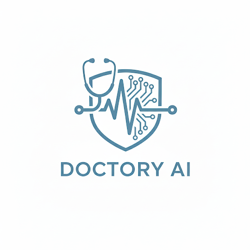

# DOCTORY AI: A Multi-Modal AI System for Preliminary Disease Diagnosis


<p align="center">
  
</p>
DOCTORY AI is an intelligent, integrated platform designed for preliminary medical diagnosis. It combines the analytical power of multiple specialized AI models with the communicative prowess of a Large Language Model (LLM) to create a seamless, user-friendly experience. Users can upload medical images or describe symptoms in a conversational manner and receive clear, empathetic, and actionable health insights.

> [A high-quality banner image or a short GIF demonstrating the final application's workflow will be placed here.]

## ⚠️ Important Disclaimer

This system is an academic proof-of-concept and serves as a preliminary, informational tool only. **It is not a substitute for professional medical diagnosis, advice, or treatment.** Always consult with a qualified healthcare provider for any medical concerns. This disclaimer is prominently displayed throughout the application.

## 📋 Table of Contents

- [About The Project](#about-the-project)
- [Key Features](#-key-features)
- [System Architecture](#-system-architecture)
- [Tech Stack](#-tech-stack)
- [Datasets](#-datasets)
- [Getting Started](#-getting-started)
  - [Prerequisites](#prerequisites)
  - [Installation](#installation)
- [Usage](#-usage)
- [Model Performance](#-model-performance)
- [Roadmap](#-roadmap)
- [License](#-license)
- [Contact](#-contact)

## 📖 About The Project

Many individuals lack immediate access to medical diagnostics, and existing digital health tools often present technical results that are confusing to the average person. DOCTORY AI was created to solve this problem by developing a unified platform that not only performs multi-modal diagnostics but also communicates the findings in an accessible and empathetic way.

The core innovation is the system's ability to automatically interpret technical model outputs. A prediction like `{"disease": "Pneumonia", "confidence": 0.96}` is seamlessly passed to an integrated LLM, which then translates it into a supportive, easy-to-understand explanation, transforming a raw data point into meaningful advice.

## ✨ Key Features

-   **Multi-Modal Diagnostic Capabilities**: The system integrates four distinct AI models for a broad range of preliminary diagnoses.
    -   🩺 **Pneumonia Detection**: Classifies chest X-ray images as 'Normal' or 'Pneumonia' using a Convolutional Neural Network (CNN).
    -   🔬 **Malaria Diagnosis**: Identifies 'Parasitized' or 'Uninfected' cells from blood smear images using a CNN.
    -   🩸 **Diabetes Prediction**: Assesses diabetes risk from tabular clinical data using an XGBoost model.
    -   ❤️ **Hypertension Classification**: Predicts hypertension risk based on clinical measurements using an XGBoost model.
-   **Conversational LLM Interface**: Users can either upload data directly or simply describe their symptoms in a chat-like interface powered by an LLM.
-   **Automated Empathetic Interpretation**: The system's unique value lies in its LLM-powered engine that automatically translates complex model predictions into clear, helpful, and responsible advice.

## 🏗️ System Architecture

The project is built on a client-server architecture. The front-end provides the user interface for interaction. The back-end routes user input (symptom descriptions or data uploads) to the appropriate pre-trained AI model. The model's prediction is then automatically sent to the LLM interpreter, which generates a final, human-readable response to be displayed to the user.

> [A diagram illustrating the system architecture (Frontend -> Backend -> AI Models -> LLM -> Frontend) will be placed here.]

## 🛠️ Tech Stack

The project leverages a modern stack for machine learning and web development:

-   **Backend**: Flask / Django
-   **Machine Learning**: Scikit-learn, XGBoost
-   **Deep Learning**: TensorFlow, Keras
-   **Data Manipulation**: Pandas, NumPy
-   **Frontend**: HTML, CSS, JavaScript
-   **LLM Integration**: Interfaced via API
## 💾 Datasets

The project utilizes four publicly available datasets from Kaggle to train and evaluate the models:

- 🩺 **[Chest X-Ray Images (Pneumonia)](https://www.kaggle.com/datasets/paultimothymooney/chest-xray-pneumonia):** This dataset contains thousands of chest X-ray images, used to train the CNN model for pneumonia detection.
- 🔬 **[Malaria Cell Images Dataset](https://www.kaggle.com/datasets/iarunava/cell-images-for-detecting-malaria):** A large, balanced dataset of cell images used to train the CNN for identifying parasitized and uninfected cells.
- 🩸 **[PIMA Indians Diabetes Database](https://www.kaggle.com/datasets/uciml/pima-indians-diabetes-database):** A standard benchmark dataset with clinical features used for training the diabetes prediction model.
- ❤️ **[Hypertension Prediction Dataset](https://www.kaggle.com/datasets/fedesoriano/stroke-prediction-dataset):** This dataset includes various clinical features for training the hypertension risk classification model.

## 🚀 Getting Started

To get a local copy up and running, follow these simple steps.

### Prerequisites

-   Python 3.9+
-   `pip` package manager
-   An API key for the Large Language Model service used.

### Installation

1.  **Clone the repository**
    ```sh
    git clone https://github.com/Jasmine25005/Doctory-AI-DEPI.git
    cd Doctory-AI
    ```
2.  **Create and activate a virtual environment**
    ```sh
    python -m venv venv
    source venv/bin/activate  # On Windows use `venv\Scripts\activate`
    ```
3.  **Install the required packages**
    ```sh
    pip install -r requirements.txt
    ```
4.  **Set up environment variables**
    -   Create a `.env` file in the root directory.
    -   Add your LLM API key to the `.env` file:
        ```
        LLM_API_KEY='your_api_key_here'
        ```

## 🖥️ Usage

1.  **Run the web application from the root directory:**
    ```sh
    python app.py
    ```
2.  **Open your web browser and navigate to `http://127.0.0.1:5000`**

You can then interact with the conversational interface by describing symptoms or navigating to the specific sections for uploading X-ray images, blood smear images, or clinical data.

> [A screenshot of the application's main conversational interface will be placed here.]

## 📊 Model Performance

All models were evaluated on a held-out test set using Accuracy, Precision, Recall, and F1-Score. The final performance metrics will be populated in the table below.

| Model        | Accuracy | Precision | Recall | F1-Score |
| :----------- | :------- | :-------- | :----- | :------- |
| Pneumonia    | TBD      | TBD       | TBD    | TBD      |
| Malaria      | TBD      | TBD       | TBD    | TBD      |
| Diabetes     | TBD      | TBD       | TBD    | TBD      |
| Hypertension | TBD      | TBD       | TBD    | TBD      |

> [Confusion matrix plots for each of the four models will be inserted here to visualize their performance on the test data.]

## 🗺️ Roadmap

Future enhancements planned for DOCTORY AI include:

-   [ ] **Expand Diagnostic Modules**: Incorporate models for other common conditions.
-   [ ] **Enhance Models**: Retrain models on larger, more diverse datasets to improve robustness.
-   [ ] **Cloud Deployment**: Deploy the application on a cloud platform (e.g., AWS, Azure) for wider accessibility.
-   [ ] **Mobile Application**: Develop a native mobile application for an improved user experience.
-   [ ] **Clinical Validation**: Collaborate with medical professionals to validate the system's performance against real-world diagnoses.

## 📧 Contact

Jasmine Mohamed Fahmy - jasminemohamed2545@gmail.com

Project Link: https://github.com/Jasmine25005/Doctory-AI-DEPI/
